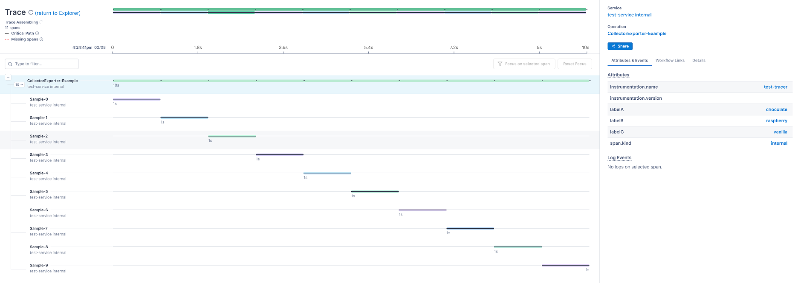

# OpenTelemetry Collector + Codespaces

This is an example of using the OpenTelemetry Collector in conjunction with GitHub Codespaces!

## About

For a quick overview, [OpenTelemetry](https://opentelemetry.io/) is an observability framework; an API, SDK, and tooling to support developers who wish to instrument their software for metrics, logs, and traces and then interpret that data. [Codespaces](https://github.com/features/codespaces) are a beta GitHub feature that allows for you to create a cloud-based IDE. One handy feature of Codespaces is that they interact with [dotfiles](https://dotfiles.github.io/) - if you have a repository named, well, `dotfiles` then the contents of that repository will be cloned to each Codespace that you create. If an `install.sh` script is present in that repository, the Codespace will execute it upon creation. We can use this to ensure that a copy of the OpenTelemetry Collector will be running on our Codespace, allowing you to get a quick feedback cycle on any telemetry you're adding to your application - there's already a collector deployed for you!

## Setup

Add the contents of `./dotfiles` to your dotfiles and commit them.
> If you don't already have one, you'll need an `install.sh` file in your dotfiles -- add `./install-collector.sh` to that file. Make sure that `install-collector.sh` is `+x`! Make sure to include `collector-config.yaml` as well.

There is no step two.
> Once you've updated your `dotfiles` repository, the next Codespace you create will include a collector.

## Usage and Configuration

The default configuration included here will open a gRPC OTLP listener on port `55680`, and will export to an OTLP receiver and text (specifically, `nohup.log`). In this example, I'm using [Lightstep](https://app.lightstep.com/signup/developer?signup_source=apgh) for their free community account, but OpenTelemetry works with many other tools. 

One thing to note, I'm using [secrets](https://docs.github.com/en/github/developing-online-with-codespaces/managing-encrypted-secrets-for-codespaces) in order to inject my Lightstep access token into the collector's configuration file.

If you set that up, you should be able to run `go run main.go` and see traces and metrics in Lightstep after a few moments, like so:

## Other Useful Links

The code used in `main.go` comes from the [OpenTelemetry Go Examples](https://github.com/open-telemetry/opentelemetry-go/tree/main/example/otel-collector).